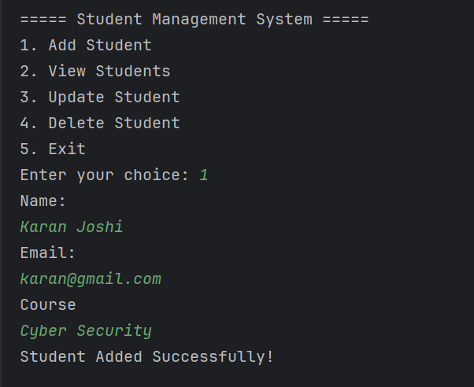
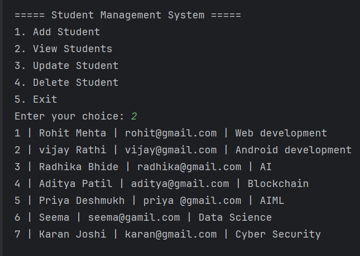
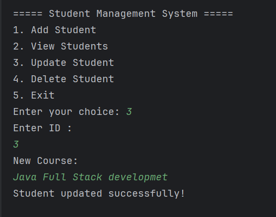
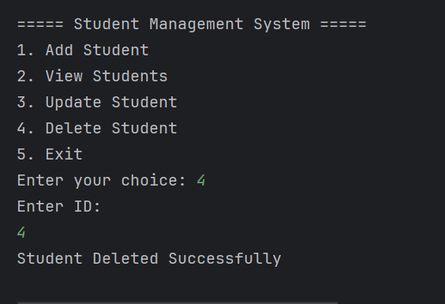
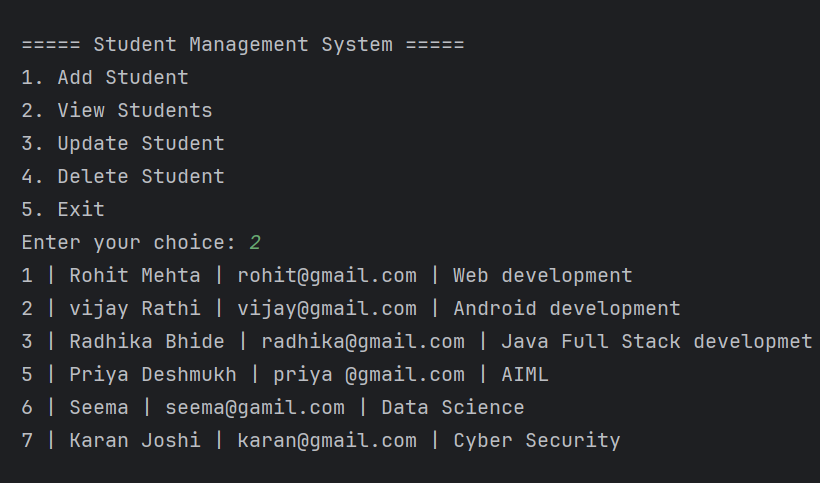
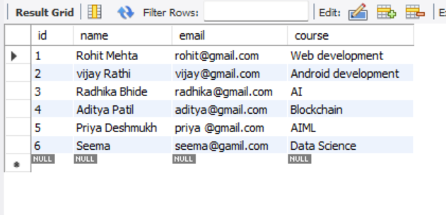

# 🎓 Student Management System (JDBC + MySQL)

A console-based backend project built using **Java, JDBC, and MySQL**.  
This project demonstrates CRUD operations using the DAO design pattern and proper layered architecture.

---

## 🚀 Tech Stack

- Java
- JDBC
- MySQL
- Maven
- IntelliJ IDEA

---

## 📌 Features

- ➕ Add new student
- 📄 View all students
- ✏️ Update student details
- ❌ Delete student
- 🔒 Uses PreparedStatement to prevent SQL Injection
- 🧱 Follows DAO Pattern for clean architecture

---

## 🏗️ Project Structure
```js
src/main/java/com/sms
│
├── model
│ └── Student.java
│
├── dao
│ └── StudentDAO.java
│
├── dao/impl
│ └── StudentDAOImpl.java
│
├── util
│ └── DBConnection.java
│
└── main
    └── Main.java
```

---

## 🗄️ Database Setup

### 1️⃣ Create Database

```sql
CREATE DATABASE sms;
USE sms;
```
## 2️⃣ Create Table
```js
CREATE TABLE students (
    id INT PRIMARY KEY AUTO_INCREMENT,
    name VARCHAR(100) NOT NULL,
    email VARCHAR(100) UNIQUE NOT NULL,
    course VARCHAR(100) NOT NULL
);
```
---
## ⚙️ Configuration
Update your MySQL credentials in:
com.sms.util.DBConnection
```js
private static final String URL = "jdbc:mysql://localhost:3306/sms";
private static final String USER = "root";
private static final String PASSWORD = "your_password";
```
---
## ▶️ How to Run
- Clone the repository
- Open in IntelliJ IDEA
- Make sure MySQL server is running
- Update DB credentials
- Run Main.java
- Use the console menu to perform CRUD operations
---
## 🖼 Project Screenshots

###  ADD STUDENT RECORD AND VIEW STUDENT RECORD
<p align="center">
  
  
</p>

### UPDATE STUDENT RECORD AND DETELET STUDENT RECORD

<p align="center">
  
  
</p>

### Database Screenshot
<p align="center">
  
  
</p>


